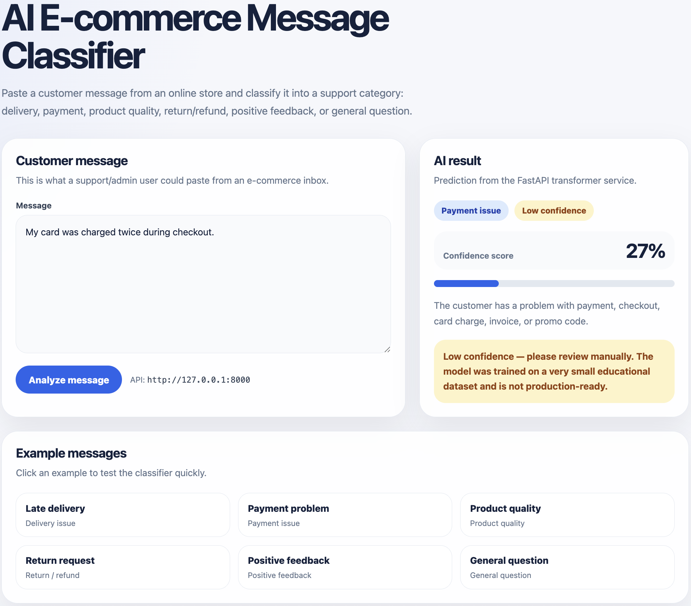

# Day 150 — AI E-commerce Message Classifier Demo

## Project overview

AI E-commerce Message Classifier is a mini production-style AI feature for an online store admin/support workflow.

The app classifies customer messages into business categories:

- `delivery_issue`
- `payment_issue`
- `product_quality`
- `return_refund`
- `positive_feedback`
- `general_question`

## User flow

1. Admin/support user enters a customer message.
2. Next.js UI sends the message to FastAPI.
3. FastAPI loads a fine-tuned DistilBERT classifier.
4. API returns category, score, and confidence flag.
5. UI displays the result and warns when confidence is low.

## Demo screenshot



## Backend

Run from repo root:

```bash
uvicorn scripts.day148_ecommerce_message_api:app --reload
```

Backend URL:

```text
http://127.0.0.1:8000
```

Health check:

```text
GET /health
```

Model info:

```text
GET /model-info
```

Main prediction endpoint:

```text
POST /classify-message
```

## Frontend

Run from frontend folder:

```bash
cd frontend/day139-semantic-search-ui
npm run dev
```

Frontend URL:

```text
http://localhost:3000
```

## API endpoint

### Request

```json
{
  "message": "My order arrived late and the package was damaged."
}
```

### Response

```json
{
  "category": "delivery_issue",
  "score": 0.2237,
  "is_confident": false
}
```

## API curl example

Run while FastAPI is active:

```bash
curl -X POST "http://127.0.0.1:8000/classify-message" \
  -H "Content-Type: application/json" \
  -d '{"message": "I want to return this product and get a refund."}'
```

Example response:

```json
{
  "category": "return_refund",
  "score": 0.2177,
  "is_confident": false
}
```

## Response fields

| Field | Type | Meaning |
|---|---|---|
| `category` | string | Predicted e-commerce support category |
| `score` | number | Model confidence score from 0 to 1 |
| `is_confident` | boolean | Whether the score is above the confidence threshold |

## Categories

| Category | Meaning |
|---|---|
| `delivery_issue` | Problems with delivery, shipping, tracking, damaged package, or pickup point |
| `payment_issue` | Problems with checkout, card payment, invoice, duplicate charge, or promo code |
| `product_quality` | Problems with product quality, broken item, scratches, wrong size, or mismatch with description |
| `return_refund` | Customer wants to return, exchange, cancel, or get a refund |
| `positive_feedback` | Customer is happy with product, delivery, support, or store experience |
| `general_question` | General product, availability, delivery, color, size, or store policy question |

## Known limitations

This is an educational mini production project.

The model was trained on a very small dataset:

- 36 total examples
- 24 training examples
- 12 test examples
- 6 categories
- 4 train examples per category

Because of this, confidence scores are low and the model is not production-ready.

The API intentionally returns `is_confident: false` when the model score is below the confidence threshold. This prevents the UI from presenting weak predictions as reliable decisions.

## Evaluation summary

Day 147 evaluation result:

```text
Eval accuracy: 0.3333
Eval loss: 1.6423
```

This result is expected for such a tiny dataset. The goal of this mini project is to demonstrate the full production-style workflow:

```text
dataset
↓
training script
↓
saved local model
↓
FastAPI backend
↓
Next.js UI
↓
demo documentation
```

## Future improvements

- Collect real anonymized e-commerce customer messages
- Add more examples per category
- Add multilingual support for Ukrainian, Finnish, and English messages
- Add error analysis per category
- Add confusion matrix and classification report
- Add MLflow tracking for experiments
- Add Docker setup for the API
- Add GitHub Actions checks
- Add monitoring for prediction distribution and low-confidence rate
- Add API tests with `pytest`
- Add frontend loading/error states tests
- Add better UI badges and category-specific colors
- Add GDPR/privacy checklist for customer message handling

## Portfolio summary

Built a full-stack AI e-commerce message classifier using a fine-tuned transformer model, FastAPI backend, and Next.js UI.

The project demonstrates:

- e-commerce AI use case
- transformer fine-tuning
- FastAPI model serving
- request validation
- confidence threshold
- Next.js frontend integration
- demo documentation
- known limitations and improvement plan
